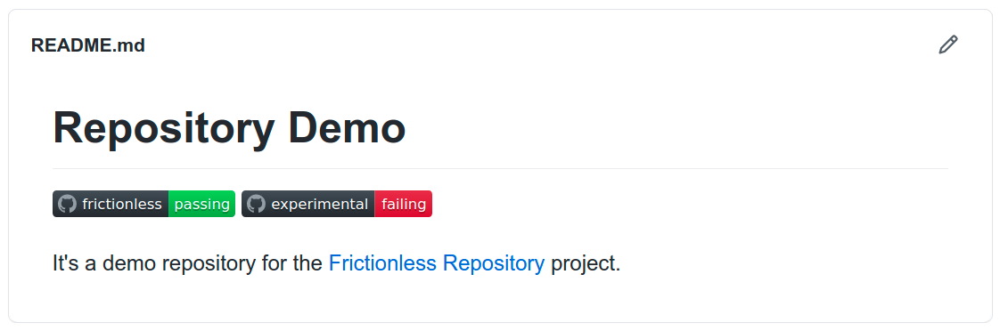
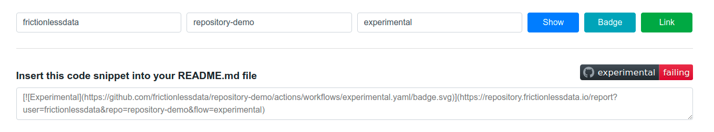

# Badges

It's really useful to have validation badges added to your README.md:

> Explore a [Live Example](https://github.com/frictionlessdata/frictionless-ci-demo) of this repo

You can get a markdown code or your badge by clicking on the "Badge" button on the [report page](getting-started.md#usage):

Adding this code to your readme will create a clickable image that will be updated on every commit to your repository and will redirect you to a validation report on a click.
